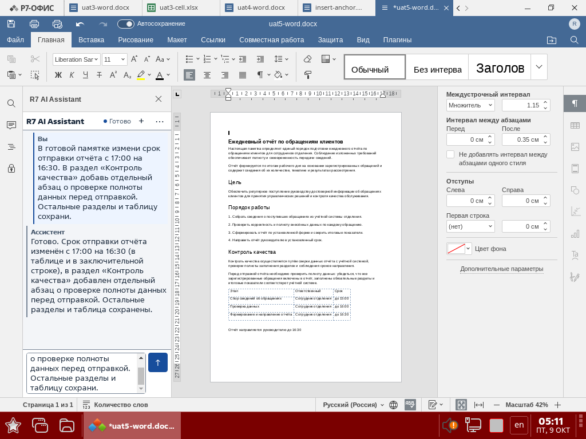
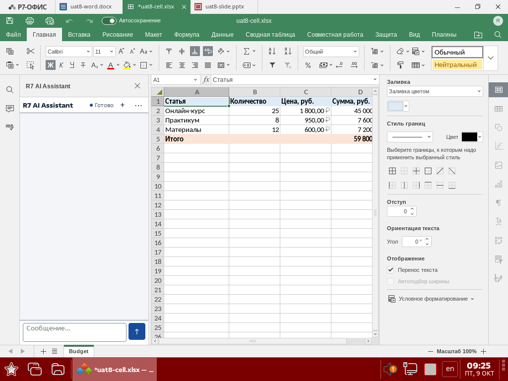
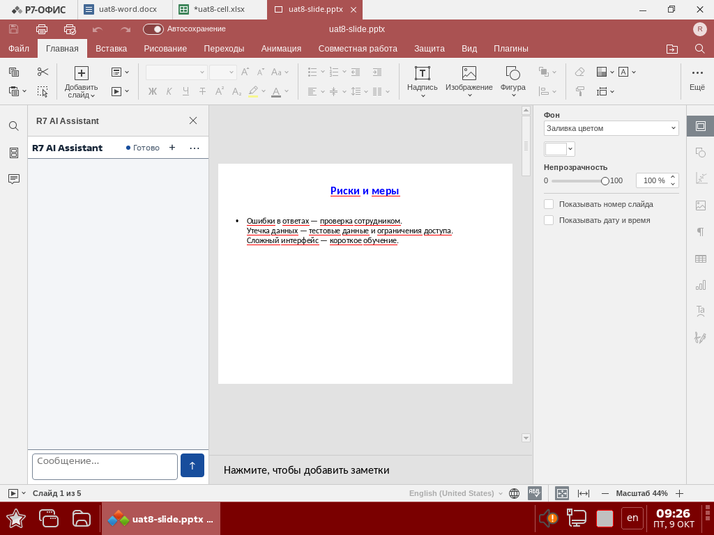
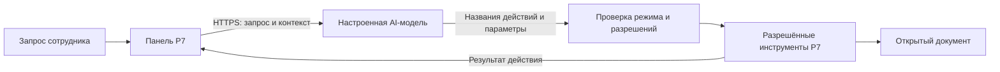

# R7 AI Assistant

AI-помощник в боковой панели Р7-Офис: задавайте вопросы по открытому документу, составляйте тексты, заполняйте таблицы и изменяйте презентации обычным языком.

**Пилотная версия · Astra Linux · Word / Cell / Slide**

[Скачать v0.9.0-pilot-rc.1](https://github.com/blazar-source/r7-ai-assistant/releases/tag/v0.9.0-pilot-rc.1) · [Установить](docs/deployment.md) · [Начать работу](docs/user-guide.md) · [Инструменты](docs/tools.md) · [Помощь](docs/troubleshooting.md)

Это независимый проект, не официальный продукт АО «Р7». Для работы нужна установленная и лицензированная копия Р7-Офис.

## Что можно сделать

| Редактор | Возможности | Пример запроса |
|---|---|---|
| Word — документы | Читать и искать текст, добавлять заголовки, абзацы и таблицы, заменять текст и применять поддерживаемое оформление | «Подготовь памятку: цель, порядок работы, контроль качества и таблица ответственных» |
| Cell — таблицы | Читать и записывать диапазоны, вводить формулы, оформлять ячейки, добавлять и переименовывать листы | «Составь бюджет обучения с количеством, ценой, суммой по каждой статье и общим итогом» |
| Slide — презентации | Читать структуру, добавлять, дублировать и переставлять слайды, менять текст и его оформление | «Добавь слайд с рисками пилота и перенеси его в конец» |

Подробный [каталог инструментов](docs/tools.md) описывает доступные операции и их границы. [Три пошаговых сценария](docs/examples.md) показывают запрос, последующую правку и проверку результата. Ассистент работает с открытым документом; сохранение выполняет пользователь средствами Р7.

## Как это выглядит

Реальные тестовые документы на Astra из приёмки пилота; это примеры результата, а не обещание одинакового оформления для любого запроса.



<details>
<summary>Cell: финансовая таблица после повторного открытия</summary>



</details>

<details>
<summary>Slide: презентация после повторного открытия</summary>



</details>

## Быстрый старт

1. Администратор скачивает комплект из [Releases](https://github.com/blazar-source/r7-ai-assistant/releases/tag/v0.9.0-pilot-rc.1), проверяет SHA256SUMS, устанавливает DEB и активирует плагин для сотрудника по [инструкции](docs/deployment.md). Node.js и средства разработки сотруднику не нужны.
2. В Р7 откройте тестовый документ и панель **R7 AI Assistant** через вкладку **Плагины**.
3. При первом запуске введите выданные администратором адрес сервера, модель и API-ключ. Нажмите **«Сохранить и проверить»**.
4. Выберите **ASK** для вопроса или **EDIT** для изменения, введите задание и нажмите **↑** либо `Ctrl+Enter`. Переключатель режима находится в **⋯ → Диагностика → Режим**.
5. Проверьте видимый результат и сохраните файл. Если показан предпросмотр замены выделения, изменения применяются отдельной кнопкой **«Применить»**.

Подключение общее для трёх редакторов одного пользователя ОС и сохраняется после перезапуска Р7. Изменение ключа: **⋯ → Настройки подключения**. [Руководство пользователя](docs/user-guide.md) · [Инструкция администратору](docs/admin-connection.md).

## Как работает ассистент



Модель выбирает действия из ограниченного каталога. Плагин проверяет их параметры и выполняет заранее написанные команды Р7; код, сгенерированный моделью, не исполняется. Агент может прочитать документ, выполнить несколько действий и проверить результат. Полноту естественного задания и качество оформления всё равно оценивает пользователь.

**ASK** исключает инструменты изменения. **EDIT** разрешает изменения по заданию; большинство из них выполняются сразу. Предпросмотр требуется для отдельной операции замены выделения, а не для каждого изменения. [Техническая архитектура](docs/architecture.md) · [Протокол модели](docs/ai-protocol.md).

## Требования и данные

| Компонент | Проверенная конфигурация |
|---|---|
| ОС | Astra Linux SE 1.7.9, build 1.7.9.41, amd64 |
| Р7-Офис | Пакет `2026.1.2-1942~astra-signed`, приложение `2026.1.2.1942` |
| AI-сервер | HTTPS endpoint `/v1/chat/completions`, идентификатор модели и ключ; требуется совместимость ответа с протоколом плагина |
| Установка | DEB и активация для конкретного пользователя ОС |

Запросы, переданный контекст и результаты чтения документа уходят на настроенный AI-сервер. Это не полностью локальная обработка: допустимость передачи данных определяет организация. Телеметрии и дополнительных серверных служб в продукте нет.

Ключ хранится локально с AES-256-GCM в профиле Р7. Ключ шифрования находится в том же браузерном профиле: это защита от хранения открытым текстом, а не системное хранилище секретов. [Подробнее о данных и защите](docs/security.md).

## Статус и ограничения пилота

Выпуск **Pre-release**. Для неизменного runtime приняты 1447 тестов и нативные сценарии Word/Cell/Slide с сохранением и повторным открытием. Лицензионное обновление `.1` прошло 23 адресные проверки и проверку установки. Точные байты и границы проверки описаны в приложенных к выпуску `release-manifest.json` и `final-review.md`.

- В Slide чтение после **«Отменить»** может удалить возможность **«Повторить»** и добавить пустые шаги истории. Это неисправленный дефект, принятый владельцем только для пилота; перезапуск потерянный повтор не восстанавливает.
- Банковский контур TLS/CORS/AUTH/Qwen и ЗПС не подтверждены. Другие версии Astra/Р7 и платформы не заявлены как поддерживаемые.
- Не все объекты и виды оформления офисных документов доступны. Нет гарантии выполнения произвольной задачи или безошибочности ответа модели.

[Полные ограничения и эксплуатация](docs/deployment.md#known-limitations) · [Доказательства приёмки](docs/evidence/release-uat/verification.md).

## Документация и поддержка

- **Сотруднику:** [работа с панелью](docs/user-guide.md), [примеры](docs/examples.md), [частые проблемы](docs/troubleshooting.md).
- **Администратору:** [установка, обновление, удаление](docs/deployment.md), [смена подключения](docs/admin-connection.md), [безопасность](SECURITY.md).
- **Техническому специалисту:** [инструменты](docs/tools.md), [архитектура](docs/architecture.md), [AI-протокол](docs/ai-protocol.md), [совместимость](docs/compatibility-matrix.md).
- **О проекте:** [изменения](CHANGELOG.md), [направления развития](docs/roadmap.md), [лицензирование](docs/licensing.md).

Для пилота первая линия поддержки — администратор вашей организации. Пользователи могут оформить [Issue](https://github.com/blazar-source/r7-ai-assistant/issues) по [памятке](docs/troubleshooting.md#report). Порядок сообщения о возможной уязвимости — [SECURITY.md](SECURITY.md).

## Разработка

```sh
npm ci --ignore-scripts
node --test
npm run audit
```

Проверенный toolchain: Node.js `v24.21.0`, `acorn@8.15.0`, `esbuild@0.25.10`. Сборки создаются из зафиксированного коммита; `dist/` не хранится в Git. [Контракт сборки и приёмки](docs/superpowers/plans/2026-10-08-sprint-8-release-contract.md). Документы спринтов и handoff — история разработки, а не руководство пользователя.

## Лицензия

Правообладатель — **Бугров Геннадий Дмитрович**. Личное некоммерческое использование бесплатно. Банку, которому правообладатель предоставил продукт для пилота или подтвердил участие, разрешён внутренний пилот. Остальное коммерческое использование и постоянная промышленная эксплуатация требуют отдельного разрешения. [LICENSE](LICENSE) · [Сторонние компоненты](THIRD_PARTY_NOTICES.md).

Исходный код и сборки доступны публично. Условия использования определяются лицензией: публичный доступ не предоставляет разрешения на коммерческое использование.
