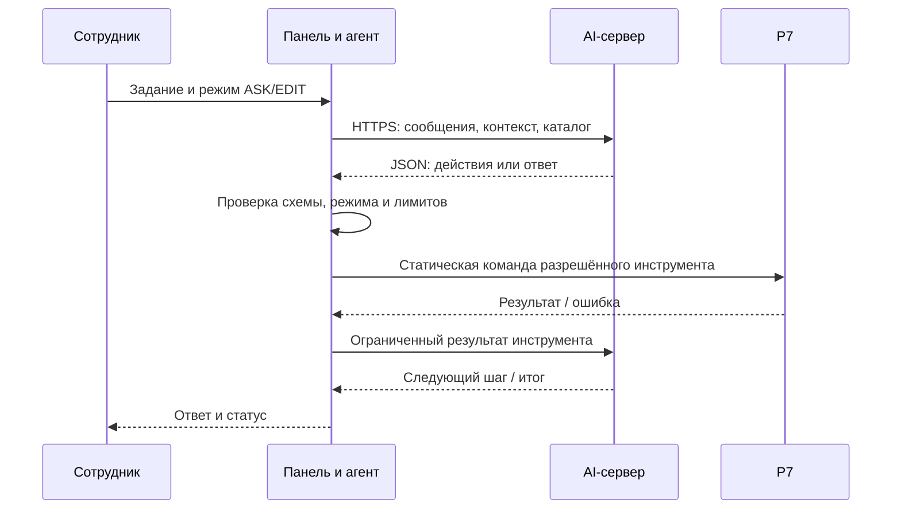

# Архитектура R7 AI Assistant

Описание поставляемой пилотной версии `0.9.0-pilot-rc.1`. Ассистент встроен в боковую панель Р7 Desktop и работает с текущим открытым документом через API редактора. Он не использует файловый OOXML-конвейер `dsh-r7-office`, MCP или внешний локальный мост.

## Поток выполнения

Агент выполняет ограниченный цикл шагов. Инструмент получает проверенные данные, а не исполняемый код модели. Результаты чтения считаются недоверенными данными и не могут предоставлять дополнительные разрешения. Проверки после записи зависят от инструмента; они не доказывают автоматически выполнение всех требований естественного запроса.

## Компоненты

| Модуль | Ответственность |
|---|---|
| `src/ui` | Чат, меню, подключение, контекст, статусы, предпросмотр и подтверждение |
| `src/agent` | Цикл действий, история, JSON-протокол, лимиты, остановка и обработка результатов |
| `src/ai` | HTTPS-запрос и разбор текстового ответа модели |
| `src/tools` | Закрытый каталог Word/Cell/Slide, схемы аргументов и политики |
| `src/plugin` | Связь с Р7, жизненный цикл, статические обработчики и владение callback |
| `src/security`, `src/shared` | Проверки, общие контракты и ограничения ресурсов |

[Каталог инструментов](tools.md) · [AI-протокол](ai-protocol.md).

## Разрешения и результат

ASK исключает инструменты изменения. EDIT допускает операции `auto`; они выполняются по запросу пользователя без отдельного подтверждения. `replace_selection` имеет политику `confirm` и отдельный Preview/Apply-путь; инструменты `deny` недоступны. Предпросмотр не является общим шлюзом для всех правок.

Перед заменой выделения проверяются текущий редактор/документ и точное совпадение исходного текста. Это не атомарная транзакция с блокировкой документа. При неизвестном результате уже отправленной команды нельзя обещать откат или безопасный повтор. «Стоп» прекращает дальнейшую работу, но не отменяет уже выполненные изменения.

Сохранение остаётся действием пользователя/самого Р7. Встроенные Undo/Redo имеют известное ограничение: чтение Slide после Undo может удалить Redo. Это принятый владельцем дефект пилота, не исправленная функция.

## Данные и подключение

Профиль подключения общий для трёх редакторов одного пользователя ОС, хранится в IndexedDB с AES-256-GCM. CryptoKey находится в том же профиле; это не системное хранилище секретов. Открытые панели синхронизируют настройки, а текущая операция сохраняет исходный снимок подключения. Чат хранится в памяти.

На настроенный HTTPS-сервер передаются сообщения, выбранный контекст и результаты инструментов. В поставке нет Node runtime, daemon, MCP, слушающего порта, CDN или телеметрии. Административная настройка выполняется в сессии сотрудника; отдельные роли и централизованное управление профилями не реализованы.

[Модель угроз и утверждённые исключения SDK](security.md) · [Эксплуатация и совместимость](deployment.md).

## Статус и история решений

Текущий статус — приватный Pre-release для проверенной конфигурации Astra/Р7. [Приёмка](evidence/release-uat/verification.md) и приложенные к выпуску манифесты определяют проверенные байты. Банковский контур и ЗПС остаются непроверенными.

Исторические этапы, ADR, планы и отчёты сохранены в Git и `docs/superpowers`, `docs/decisions`, `docs/evidence`. Их промежуточные статусы относятся к указанным ревизиям и не заменяют текущий статус выпуска.
