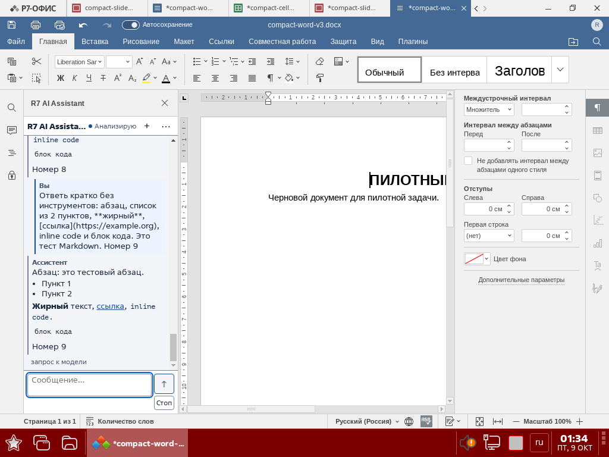
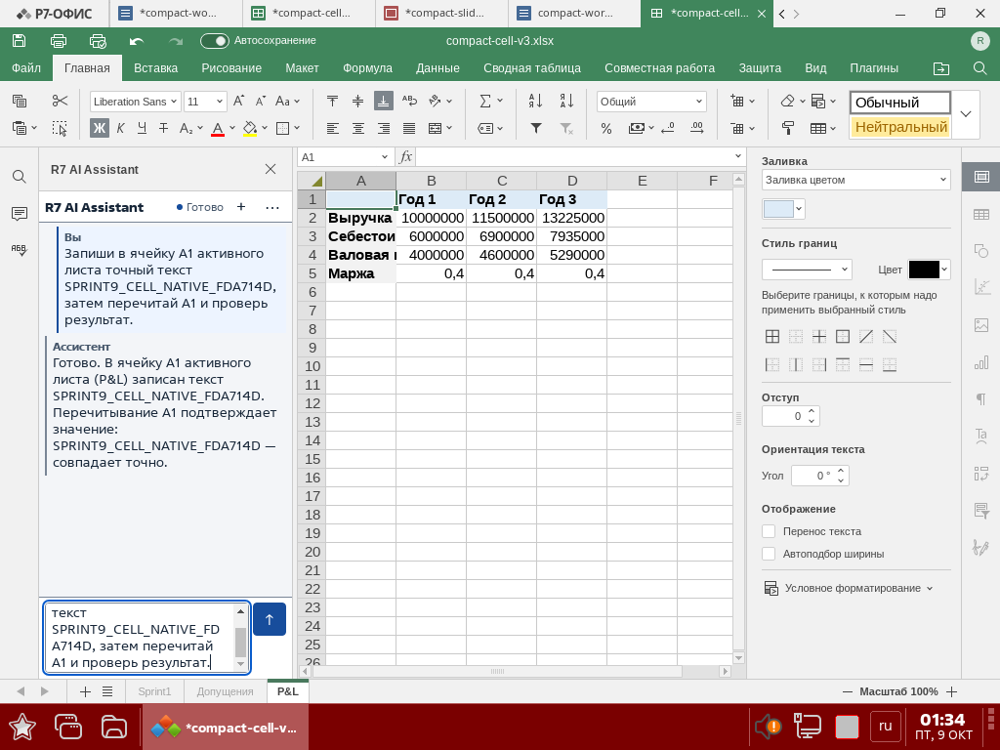
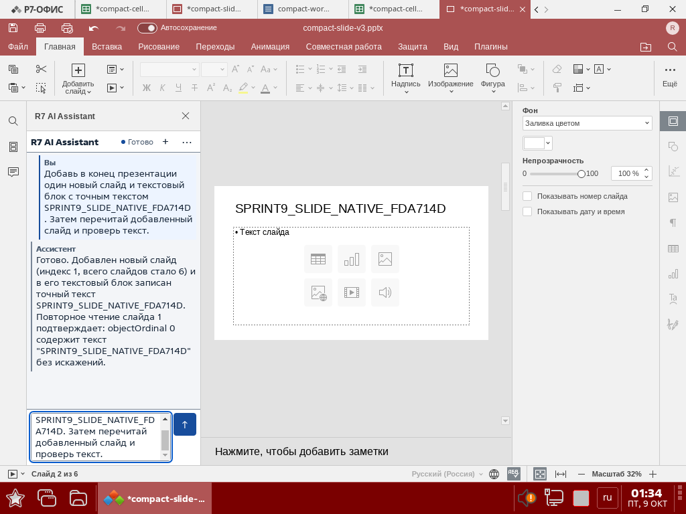

# Native compact panel — final `fda714d`, 2026-10-09

Product identity, package lifecycle and document outcomes: [Sprint 8 final verification](../sprint-8/final-verification-fda714d.md). The owner-approved numeric design was retained; the original proposal's historical approval gate does not override the current authorization.

Real Astra plugin frame: **259 × 499 CSS px**, document/client sizes **259 × 499**, header **32 px**. The Word journey was followed by ten real ASK turns, reaching **22 alternating messages** without another document edit. Markdown DOM contains 35 paragraphs, 9 lists, 9 emphasis nodes, 9 links, 9 inline-code examples and 9 fenced-code examples.

| Check | Measured result |
| --- | --- |
| Single history scroll | Only `#content` has non-control vertical overflow; unchanged with diagnostics open |
| Idle composer | y449, height 50; same coordinates at first and last transcript content |
| Working composer | y426, height 73; content height 394 |
| Visible working stage | y404–420, above composer y426; tail, stage, draft, Send and Stop are visible in native capture |
| Send | x219, y432, 34 × 34 while working; inside frame |
| Draft | 38 px initially; 72 px cap; expanded composer 84 remains within frame |
| Budget warning | One 14 px line; with capped draft composer 102, Send fully contained; document still 259 × 499 |
| Typography | Message 12.5/17, status 11/16, code 11.5/16, header 13/18 |
| Rhythm | History horizontal inset 6; message padding 4 top/5 bottom, gap 3; side rule 2 |
| Role treatment | `user` / `assistant`, separate compact labels, user background/indent, no rounded full-border cards |
| Headings | One internal panel h1; host R7 chrome has its own plugin caption outside the measured frame |
| Diagnostics | Hidden rectangle 0 ×0; opening retains single content scroller |
| Keyboard | Native CDP Tab: new chat → diagnostics → nine history links → draft → Send; focused controls/links have 2 px solid outline and accessible names |
| Contrast | Existing palette retained; automated body/role/status and boundary contrast checks pass; no contrast assertion was suppressed |

The history's idle 417 px / working 394 px viewport exceeds the required 18 / 17 message-line equivalents. Native screenshots corroborate dense flat messages, contained actions, the visible `+` glyph and focus outline. The first fullwidth glyph did not render correctly with the Astra font; final `fda714d` fixes it.

These are genuine root-window captures after ordinary `loginctl unlock-session 3`; the earlier locker-only capture was discarded as acceptance evidence. No security setting was disabled. Native Cell/Word pixel evidence is therefore no longer globally NOT VERIFIED.

The Cell screenshot itself shows blank A1 despite the positive tool and independent SDK readbacks. Its role here is panel appearance, not visible cell-effect proof; the discrepancy's cause is not established. The later standalone Word renderer probe starts with an extra space after the fixture title compared with the earlier journey; its equal before/after establishes only that this probe left its starting document unchanged. Both snapshots are retained; whole-session document immutability is not claimed.

The developer-only local Chromium harness also verifies unsafe-link handling and focus retention while messages arrive. Two additional native model requests for raw HTML/long-code examples were rejected with the existing “Ответ не соответствует разрешённому JSON формату” terminal error, leaving the 22-message transcript unchanged. Those rejected responses are not proof of native rendering.

A separate fresh-panel ASK probe then explicitly requested the permitted final JSON envelope, without tools. On the same final JS/CSS bytes, the real model returned raw `` plus a 450-character code line. The HTML remained literal: **zero img elements, execution sentinel false**. The fenced code measured clientWidth 224 / scrollWidth 3158 and clientHeight 24 / scrollHeight 24: horizontal overflow only. The document stayed 259 × 499; `#content` remained the only vertically overflowing non-control element. Independent SDK read-before/read-after showed the Word document unchanged. This closes the native raw-HTML/long-code measurement without treating the earlier protocol refusals as successful rendering.

The complete transient five-state UX-B5 pixel sequence is not claimed from one working screenshot or one-second sampling. Compact-panel geometry/Markdown/keyboard evidence does not remove that separate historical sequence limitation.

Independent review fixed two UI P2 findings (tail following on draft growth, focus retained on existing links). Overall Sprint 8 acceptance remains NOT PASS because of Slide semantics; UI completion alone does not declare RC.
